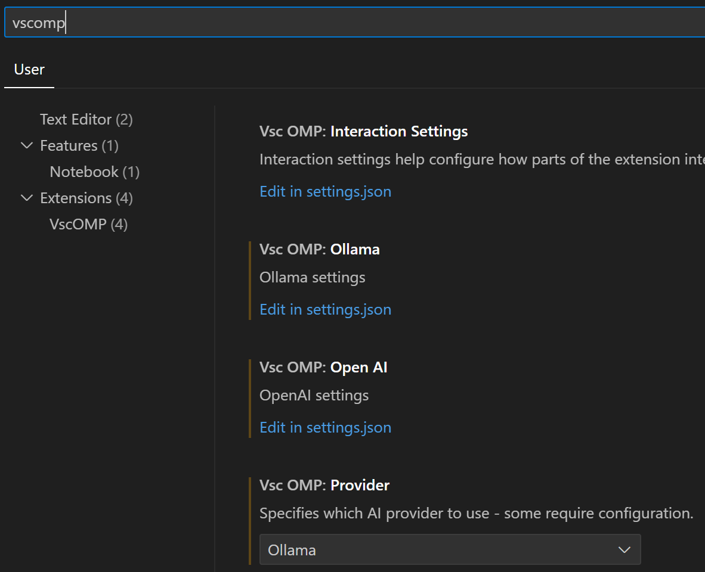

# LLMA4OpenMP-Plus

You can get the data set used in the paper at the following links:
[AutoParBench](https://github.com/llnl/AutoParBench)

## Settings

You can modify the configuration of generator and reviewer in settings.json.

## Usage

Select the loop, then press "Send message"

